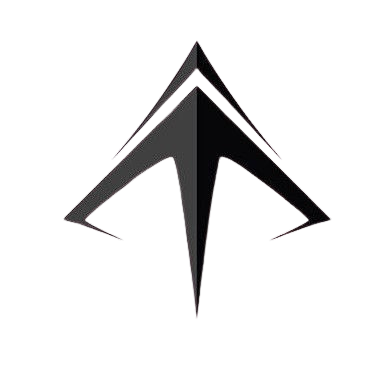

# Tracking App : 📌
It is an application for tracking devices and showing their location on a map, with smooth and fast device data management.
---------

Program concept : 
- The application allows you to add, edit, delete, and view device data.
- Each device is displayed on the map using Google Maps.
- Project objective: To learn Flutter, State Management, and an interactive user interface.

---------

Reduces usage : 🔧
- Flutter  
- Dart  
- Google Maps Flutter Plugin  
- Dealing with API (Dio)
- Bloc/Cubit (State Management)  
- Project organization using (Clean Architecture)
- is supported (Dark mode) 
- It supports Arabic and English languages.

---------

Screenshots : 📸
  


---------

Notes : 📌 
The application is scalable: Authenticator, Notifications, Analytics can be added.

Run App :
```bash
git clone https://github.com/AhmedMahmoud221/tracking_app.git
cd tracking_app
flutter pub get
flutter run
